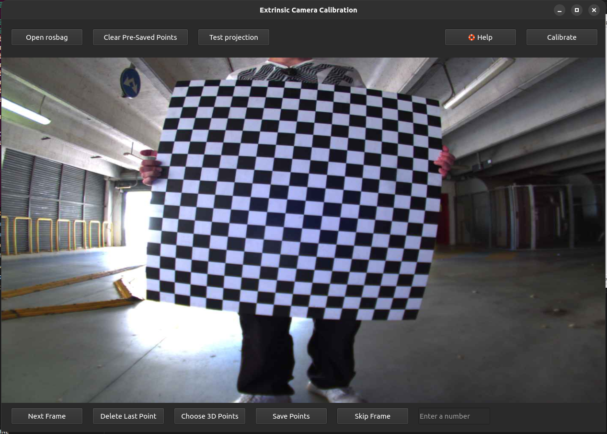
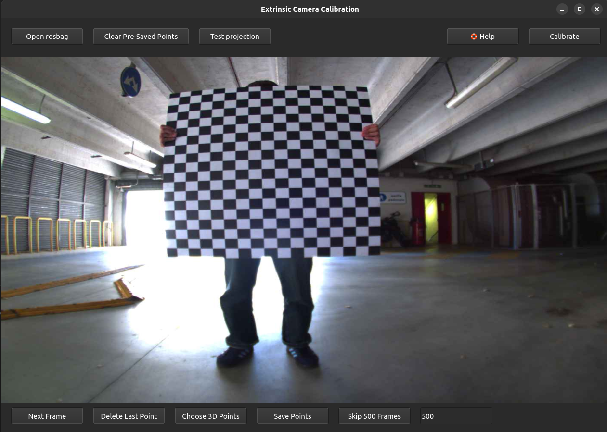
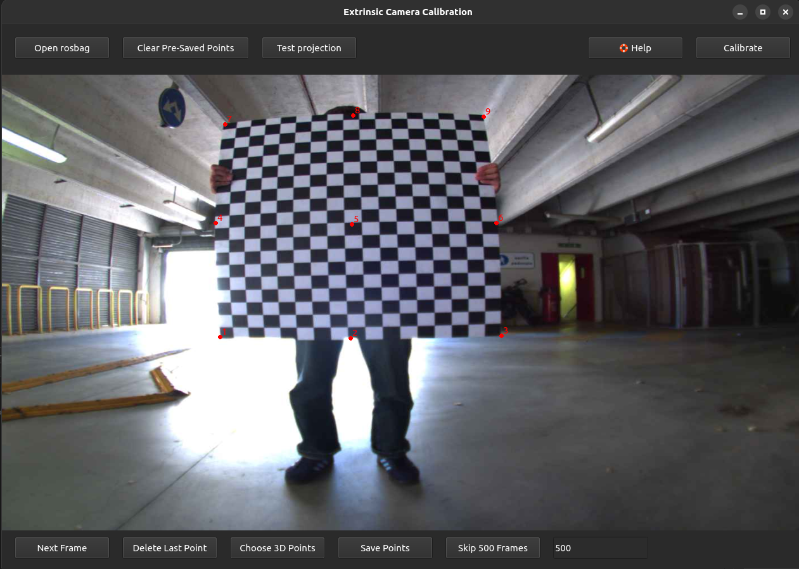

# Extrinsic calibration tool

## Usage
The second step is to obtain the two extrinsic calibration matrices `R` and `tvec`. This step requires both the camera and lidar topics.

For this calibration, a GUI was developed with **PySide6** that makes it easy for any user to calculate the extrinsic matrices.
The interface of the extrinsic calibration tool looks like this:
<div align="center">
   
   <p><em>Figure 1: Interface of the Extrinsic Calibration Tool</em></p>
</div>


Now, the various steps to be performed in order to obtain the two extrinsic matrices are listed (it is assumed that you have already saved a rosbag with the camera and lidar topics and followed the instructions given [here](./README.md)):

- First, open the rosbag you saved previously by clicking the "*Open Rosbag*" button and choosing the directory where the Rosbag is located

- To navigate between frames in the Rosbag, you can use either the "*Next Frame*" button, which displays the next frame, or the "*Skip Frame*" button, which works in conjunction with the text box to its right and skips a specified number of frames. As you enter a number in the text box, the button's name will also change. For example, if you enter 10, the button will change to "*Skip 10 Frames*".

- For each frame, you need to save the 2D points belonging to the image and the 3D points corresponding to the LiDAR points. Obviously, the more you save, the more precise the calibration will be. To save this data from a frame, follow these steps:

   - click on the image and choose some points that will then correspond to the same points you will choose in the 3D LiDAR map.

      - The selected points on the frame are numbered according to the order in which they were selected. This helps you when selecting points in the 3D world.

      - You can decide to delete the last point inserted on the image by clicking the "*Delete last Point*" button.

   - click "*Choose 3D Points*" to open the 3D map output by the LiDAR and choose the points that correspond to those previously chosen from the image. **Open3D** was used to display the 3D map.

   <div align="center">
      
      <p><em>Figure 2: Open3D</em></p>
   </div>

   - The points must be chosen in the same order in which we chose them on the image.

      - You can select points from this map by clicking on a point of the lidar with `Shift + left button` and delete the last one inserted with `Shift + right button`

      - By default, selected points are displayed very large. If you want to make them smaller, press `Shift + '`To enlarge it, press `Shift + ì`.

      - **Note**: Point selection in the 3D world ends when you close the window. However, if you reopen it, you must select all the points again.

      - While **Open3D** is open, you can click `h` to print to the terminal all the commands you can run in **Open3D**.
   
   - Once you've selected points from both the image and the LiDAR-generated points, click "Save Points." This will save the selected points to the file `data/extracted_point.txt`. This file will be something like:

   ```txt
   # u, v, x, y, z
   480,589,1.6466710567474365,0.3257509469985962,-0.32628339529037476
   669,589,1.6382578611373901,-0.05892696604132652,-0.3186510503292084
   837,583,1.647851586341858,-0.40231233835220337,-0.3297179639339447
   498,358,1.6425501108169556,0.3103630840778351,0.14624732732772827
   676,358,1.6444337368011475,-0.06489742547273636,0.14398127794265747
   ...
   ```
- Once finished, click the `Calibrate` button to generate the extrinsic matrices, which will be saved in the `camera_extrinsic_calibration.yaml` file. 
   The file will look something like this:
```yaml
rvec:
- - 1.1859260517172132
- - -1.2360282605814907
- - 1.2369375154521254
tvec:
- - -0.010045230892117783
- - -0.17478970406537822
- - -0.0435966814534273
R:
- - -0.03833113226336027
  - -0.999260541292337
  - -0.003015777769318384
- - 0.003750588895268081
  - 0.002874105064903376
  - -0.9999888362391922
- - 0.999258053448831
  - -0.03834201528638004
  - 0.003637647788268694
extrinsic_matrix:
- - -0.03833113226336027
  - -0.999260541292337
  - -0.003015777769318384
  - -0.010045230892117783
- - 0.003750588895268081
  - 0.002874105064903376
  - -0.9999888362391922
  - -0.17478970406537822
- - 0.999258053448831
  - -0.03834201528638004
  - 0.003637647788268694
  - -0.0435966814534273
- - 0.0
  - 0.0
  - 0.0
  - 1.0
```

> [!WARNING]
> When using this tool, if you have already performed an extrinsic calibration before, that data will also be used. If you do not want to use that data, click the "*Clear Pre-Saved Points*" button.  
Once you click this button, you will lose all previously saved data.

- Finally, to test the calibration (both intrinsic and extrinsic), click the `Test projection` button. This will first let you choose the rosbag to test the calibration on and then generate a video like `./output_test.avi` to check if it works correctly. **Warning**: This operation may take a few minutes if the rosbag is very large.

> [!IMPORTANT]
> It is recommended, as for intrinsic calibration, to take points in the image in such a way that it covers different points of the image and that it is also done at different distances.

## Example

To better understand how the point selection works, an example will be shown. It is recommended to perform these parameters in the order indicated.

Let's pretend we want to choose points from this frame:
<div align="center">
   
   <p><em>Figure 3: Example</em></p>
</div>

Click on "Choose 3D Points" and choose the points you want to choose on the image too. In this case the order in which the points were chosen is from bottom to top and from left to right.
<div align="center">
   
   <p><em>Figure 4: Example of choosing points in the 3D world</em></p>
</div>

Select the points on the image in the same order:

<div align="center">
   
   <p><em>Figure 5: Example of choosing points on the frame</em></p>
</div>

Finally, to save them to the file click `Save Points`.