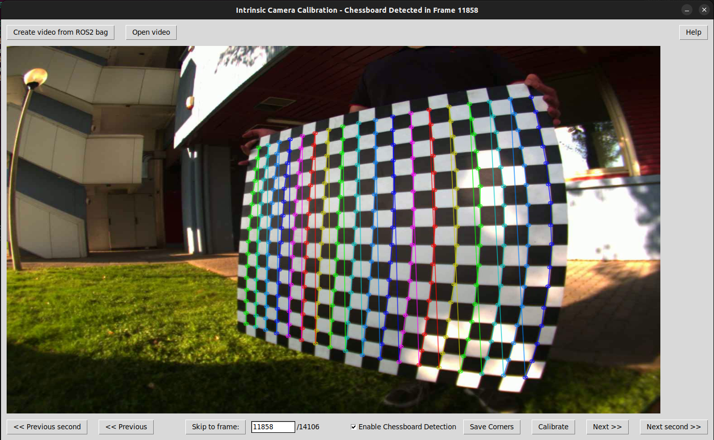

# Intrinsic calibration tool

## Usage
The first step is to obtain the two intrinsic calibration matrices `dist_matrix` and `camera_matrix`. In this step you only need the camera topic.

For this calibration, a GUI was developed with **tkinter** that makes it easy for any user to calculate the intrinsic matrices.
The interface of the intrinsic calibration tool looks like this:
<div align="center">
   
   <p><em>Figure 1: Interface of the Intrinsic Calibration Tool</em></p>
</div>

Now, the various steps to be performed in order to obtain the two intrinsic matrices are listed (it is assumed that you have already saved a rosbag with the camera topic and followed the instructions given [here](./README.md)):

- If you've already saved a video from a Rosbag, you can skip this step. Otherwise, click the "*Create video from ROS2 bag*" button and select the folder containing the previously saved Rosbag. This may take a while. The resulting video will be saved to `video/rosbag_name.mp4`.

- Once you have created the video, click on "*Open video*" and select the video you want to calibrate.

- Now, navigate through the video frames and save the corners when the chessboard is detected (obviously you don't have to save all the frames, but try to diversify by taking images where the chessboard is in different positions and at different angles).  
Here we will explain the various actions you can perform while navigating through the video frames:

   - "*Previous*" and "*Next*" allow you to navigate to the previous and next frame respectively.
   - "*Previous second*" and "*Next second*" allow you to navigate to the frame corresponding to the previous and next second of the current frame respectively.
   - "*Skip to frame*" is used in conjunction with the text box to its left to skip to the chosen frame
   "*Enable Chessboard Detection*" when checked allows the chessboard to be detected in the image. This option was included because if the algorithm doesn't detect the chessboard, it would slow down frame navigation. Therefore, if you know that some frames will not be selected, it's recommended to deselect this option.
   - "*Save corners*" allows you to save the corners if the board is detected in the current frame.
- Once you have saved enough images (it is recommended to save at least 30), then click the "*Calibrate*" button to obtain the two intrinsic matrices.
- If you are satisfied with the results obtained, close the window to proceed to **extrinsic calibration**.

> [!NOTE]
> You can also perform the calibration on two different videos (obviously from the same camera). Therefore, you could first save some corners from some frames of one video, then open another video and save other corners from it before proceeding with the calibration.

## Results

The calibration output is the `camera_matrix` and `dist_coeffs` matrices, present in the `config/camera_intrinsic_calibration.yaml` file, which looks like this:

```yaml
calibration_date: '2025-10-06 10:13:13'
camera_matrix:
  columns: 3
  data:
  - - 825.1457276140824
    - 0.0
    - 675.7629462301549
  - - 0.0
    - 823.5834276431173
    - 513.218938207676
  - - 0.0
    - 0.0
    - 1.0
  rows: 3
chessboard:
  pattern_size:
    columns: 16
    rows: 18
  square_size_meters: 0.43
distortion_coefficients:
  columns: 5
  data:
  - -0.34046271249641213
  - 0.10297550611298478
  - -0.0005278214404945335
  - -0.00038837869939123545
  - -0.012591783288386787
  rows: 1
image_size:
  height: 1080
  width: 1440
rms_reprojection_error: 2.5982639590261156
```

The `rms_reprojection_error` represents the reprojection error, which provides a good estimate of the accuracy of the found parameters. The closer the reprojection error is to zero, the more accurate the found parameters.